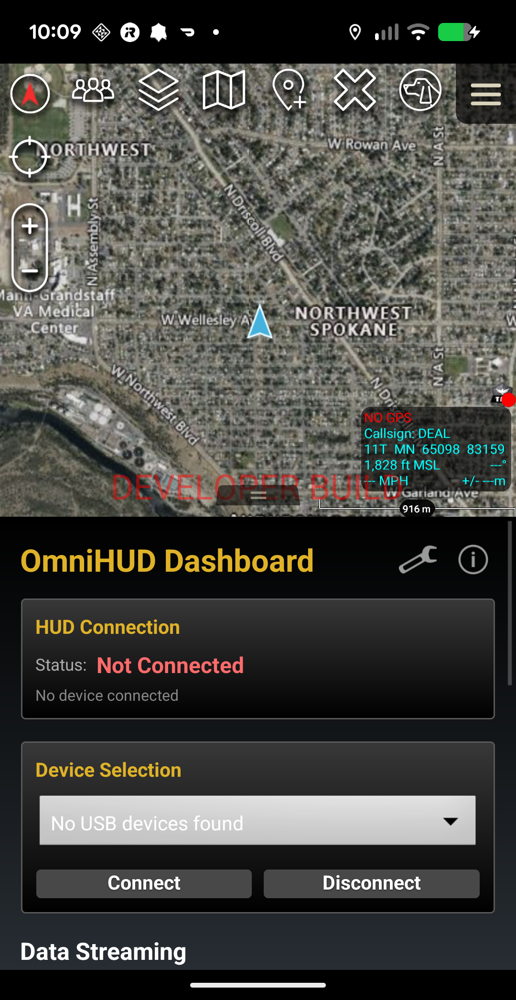
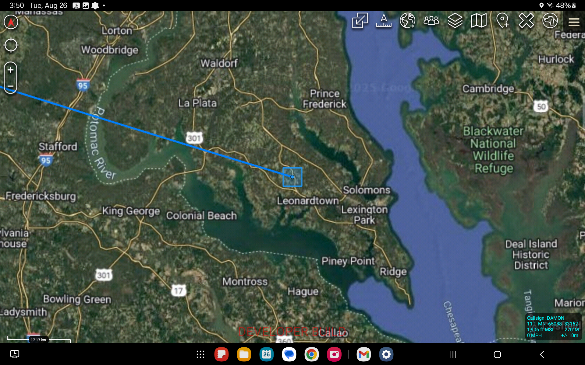

# OmniHUD

An open-source ATAK plugin for viewing and controlling HUD (Heads-Up Display) devices via USB-C cable.

## Overview

OmniHUD enables ATAK integration with HUD devices like ECOTI, allowing real-time tactical data display directly in night vision and thermal optics. This plugin communicates via USB-C to send position, waypoint, and tactical information to compatible HUD hardware.

### Features

- **USB-C HUD Communication**: Direct connection to HUD devices
- **Real-time Data Streaming**: Send ATAK data to HUD displays
- **ECOTI Support**: Optimized for ECOTI integration
- **Position Overlay**: Display user position and heading
- **Waypoint Navigation**: Send waypoints and routes to HUD
- **Contact Information**: Display nearby teammates and contacts
- **Open Source**: Enable other manufacturers to integrate

### Hardware Compatibility

- **ECOTI**: Via USB-C adapter (https://www.reddit.com/r/NightVision/comments/1oj7oiq/)
- Additional HUD devices can be added via open-source contributions

## Screenshots

### OmniHUD Dashboard



The plugin integrates directly into ATAK with a dashboard featuring:
- Real-time HUD connection status
- USB device selection and management
- Connect/Disconnect controls
- Data streaming configuration
- Device status preview

### Dropdown Menus with Readable Text


*USB device selection with optimized text visibility*


*Configurable data streaming options*


*Adjustable update frequency for power management*

## Requirements

- **ATAK Version**: 5.4.0 or newer (CIV/MIL)
- **Android**: 5.0 (API 21) or higher
- **Hardware**: USB-C capable Android device
- **HUD Device**: Compatible heads-up display unit

## Installation

1. Download the latest APK from [Releases](https://github.com/engindearing-projects/omni-HUD/releases)
2. Install on Android device with ATAK installed
3. Enable plugin in ATAK Settings → Plugin Management
4. Restart ATAK
5. Connect HUD device via USB-C

## Usage

### Connecting HUD Device

1. Connect HUD to Android device via USB-C
2. Grant USB permissions when prompted
3. Open OmniHUD from ATAK toolbar
4. Select your HUD model
5. Enable data streaming

### Data Configuration

Configure what data streams to your HUD:
- **Position**: Own location and heading
- **Waypoints**: Active navigation points
- **Contacts**: Nearby teammates
- **Routes**: Planned paths
- **Markers**: Map markers and POIs

## Development

### Building from Source

```bash
git clone https://github.com/engindearing-projects/omni-HUD.git
cd omni-HUD
./gradlew assembleCivDebug
```

### Adding New HUD Devices

OmniHUD is designed to be extensible. To add support for a new HUD:

1. Implement `HUDDevice` interface
2. Add USB VID/PID to device registry
3. Implement data formatting for your protocol
4. Submit pull request

See [CONTRIBUTING.md](CONTRIBUTING.md) for details.

## CoT Message Format

OmniHUD sends data using standard Cursor-on-Target XML format:

```xml
<?xml version='1.0'?>
<event version='2.0' uid='...' type='a-u-G' time='...' stale='...' how='h-g-i-g-o'>
<point lat='39.2' lon='-77.0' hae='121' ce='9999999.0' le='9999999.0' />
<detail>
<contact callsign='CALLSIGN'/>
<status readiness='true'/>
<!-- Additional tactical data -->
</detail>
</event>
```

## Architecture

- **USB Communication Layer**: Android USB Host API
- **CoT Parser**: Standard TAK CoT message handling
- **Device Abstraction**: Pluggable device drivers
- **Data Filter**: Configurable data selection
- **Format Converter**: Device-specific output formatting
- **Event System**: ATAK MapEventDispatcher best practices

### ATAK Best Practices

This plugin follows official ATAK best practices for map event handling:

- ✅ **Event-Driven Updates**: Uses `MapEventDispatcher` instead of polling for efficiency
- ✅ **Proper Listener Management**: Event listeners are registered and cleaned up properly
- ✅ **Push/Pop Pattern**: Tools use listener stack for exclusive event handling
- ✅ **Item Tracking**: Real-time COT item tracking via `ITEM_ADDED/REMOVED/REFRESH`
- ✅ **Memory Leak Prevention**: All listeners cleaned up on disposal

See [ATAK_BEST_PRACTICES.md](ATAK_BEST_PRACTICES.md) for detailed implementation guide.

## Contributing

We welcome contributions! This project is open-source to enable broad HUD compatibility across manufacturers.

### Areas for Contribution

- Additional HUD device support
- Protocol optimizations
- Data visualization improvements
- Documentation
- Testing with different hardware

See [CONTRIBUTING.md](CONTRIBUTING.md) for guidelines.

## License

MIT License - See [LICENSE](LICENSE) for details

## Credits

- **Hardware**: ECOTI USB-C adapter by j@engindearing.soy
- **ATAK SDK**: TAK Product Center
- **Community**: Thanks to r/NightVision for testing and feedback

## Support

- **Issues**: https://github.com/engindearing-projects/omni-HUD/issues
- **Discussions**: https://github.com/engindearing-projects/omni-HUD/discussions
- **Reddit**: r/NightVision

## Links

- **ECOTI HUD Adapter**: https://www.reddit.com/r/NightVision/comments/1oj7oiq/
- **TAK.gov**: https://tak.gov
- **ATAK Documentation**: https://tak.gov/products/atak

---

🤖 Built with [Claude Code](https://claude.com/claude-code)
